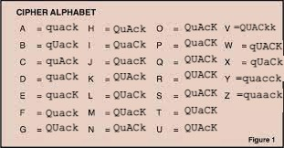

# duck cipher

The world's most secure encryption cipher. 

### Quack list: 
- [x] quack
- [x] quack
- [x] quack
- [x] quack
- [x] quack

## What is duck cipher?

Duck cipher encrypts your plaintext message into a secure, lightweight (well not really lol) and fun ciphertext. 

> quack!
> > "Its a feature, not a bug"

notes: 
- spaces are treated as a character

## Great! How do i start using this?

Grab the approriate binary executable (for ur os) from the [release](https://github.com/Rian-Tan/duck-cipher/releases/tag/v1.0.0) page

run the program using sh, exec or ./ 

## Final words

quack quack quack quack quack quack quack quack quack quack quack quack quack quack quack quack quack quack quack quack quack quack quack quack quack quack quack quack quack quack quack quack quack quack quack quack quack quack quack quack quack quack quack quack quack quack

